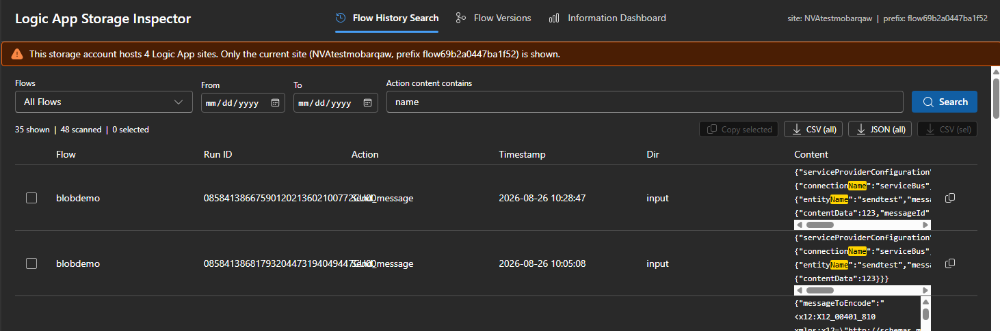
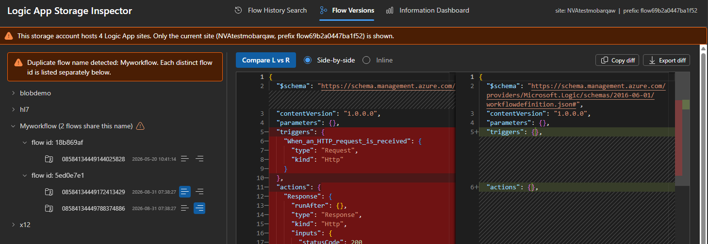
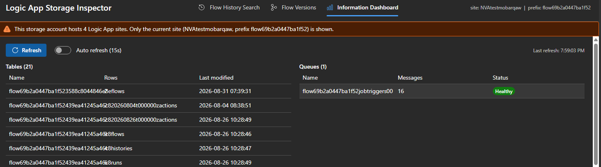

# Logic App Storage Inspector

Logic App Storage Inspector is a Kudu site extension for inspecting the storage used by an Azure Logic App Standard application.

> **Read-only:** The extension only reads Logic App storage data. It does not create, update, or delete workflows, tables, queues, blobs, messages, or other storage data.

## Functionality

### Flow history search

Search action and trigger inputs or outputs by workflow, date, and text. Results can be copied or exported as CSV or JSON.



### Flow versions

Browse workflow versions, view their JSON definitions, and compare two versions side by side.



### Information dashboard

Review workflow table information, queue depths, health indicators, and refresh status.



### Site isolation and performance

- Restricts table and queue access to the current Logic App site when a storage account is shared.
- Uses asynchronous, cancellable, and paged operations for large storage accounts.
- Performs no write operations against the Logic App or its storage account.

## Install from Kudu Site Extensions

### 1. Open Kudu

1. Open the Logic App Standard resource in the Azure portal.
2. Select **Development Tools > Advanced Tools**.
3. Select **Go** to open the Kudu/SCM site.

### 2. Install the extension

1. In Kudu, select **Site extensions**.
2. Open the **Gallery** tab.
3. Search for **Logic App Storage Inspector**.
4. Select the **+** button and confirm the installation.
5. Restart the SCM site if Kudu requests it.


### 3. Open the inspector

Use the extension link in Kudu, or browse directly to:

```text
https://<logic-app-name>.scm.azurewebsites.net/logicappstorageinspector/
```

Access to the inspector requires permission to access the Logic App's Kudu site.

## Configuration

The extension reads configuration from the Logic App environment:

| Setting | Purpose |
|---|---|
| `WEBSITE_SITE_NAME` | Identifies the current Logic App site. Provided by App Service. |
| `AzureWebJobsStorage` | Storage connection used as a fallback. |
| `AzureWebJobsStorage__accountName` | Storage account used with managed identity. |
| `LASI_TABLE_PREFIX` | Optional explicit `flow<hostId>` prefix when automatic resolution is unavailable. |
| `LASI_AUTO_REFRESH_SECONDS` | Optional dashboard refresh interval. |
| `LASI_PAGE_SIZE` | Optional default history-search page size. |

For managed identity, grant the Logic App identity the required Storage Table, Queue, and Blob data-reader permissions.

## Build the NuGet package

The [Build and release NuGet package workflow](.github/workflows/build-nuget.yml) runs on every push to `main`, on pull requests, and on manual dispatch. It:

1. Builds the React frontend.
2. Publishes a self-contained Windows x64 extension and explicitly stages the fresh frontend.
3. Creates and validates the `AzureSiteExtension` NuGet package, including this package README and matching frontend hashes.
4. Uploads the `.nupkg` as a workflow artifact.
5. Creates a GitHub Release with the `.nupkg` when started manually.

To publish a downloadable release, open **Actions > Build and release NuGet package > Run workflow**, enter a new package version, and run it. Push and pull-request builds create artifacts but do not create releases.

## Author

Mohammed Barqawi